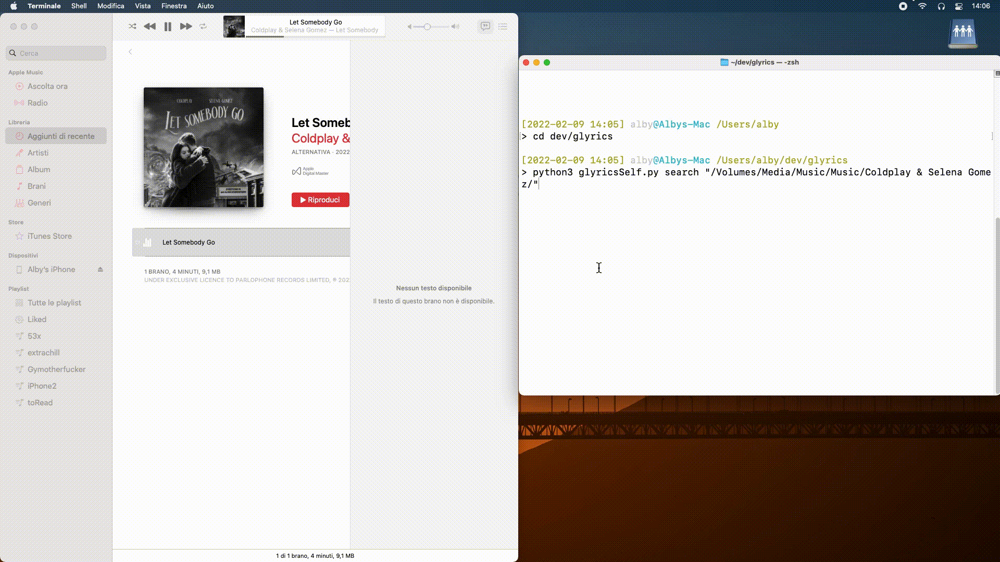
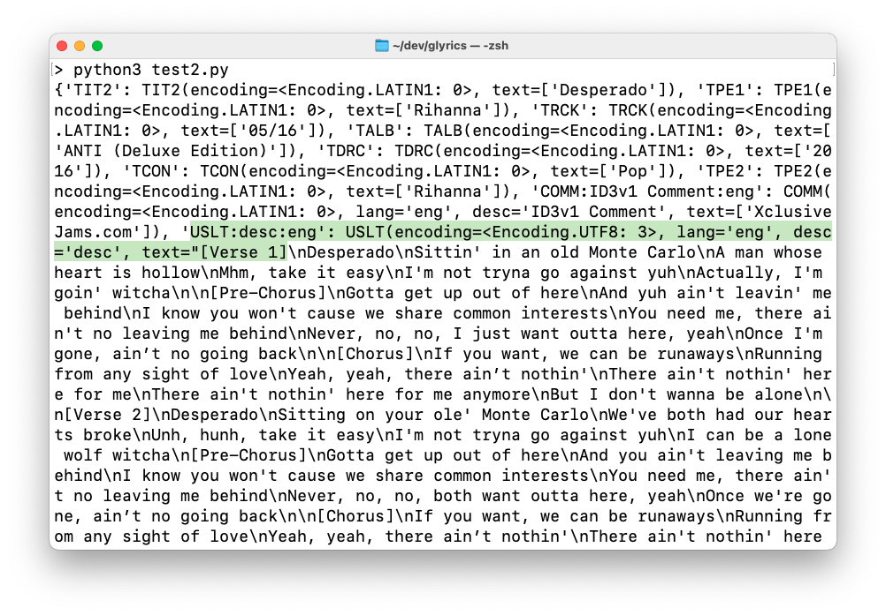

# Glyrics lyrics for Apple Music

Glyrics allow you to store the genius.com lyrics into your songs.

## IDEA

Was mainly made for iTunes/Apple Music/iPhoneMusic, insted of copy and paste inside the lyrics of songs, you can do automatically.

**Works only with mp3 and m4a**

### Some pics

## Flow

1) glyrics.py -> works with M4A and MP3 files, for each song check into a self registry (glyrics.json) if the song is already searched and founded, avoiding useless searches for songs that already have a lyrics.
	- if glyrics found the lyrics, it will store into the song file then do the MD5 of song's name and store into the registry

2) glyricsSelf.py -> works **only** with M4a, checking if the tag "©lyr" is empty or not, then it search etc..
	- not with mp3 because mp3 use differents tag (see problems chapter)

## Usage:
`$ python3 glyrics.py mode "path"`
	- mode = "search" for search/add lyrics, "flush" for delete the existing lyrics
	- path is the path to your music folder (is recursive, found every song stored in every subfolder) like /Media/Music/...

### Requirements:

- is required a good folder's structure, like iTunes does:
> 	
	artist1/
		album1/
		album2/
	artist2/
	  	album1/
	....

- Python3 with:
	- os
	- sys
	- lyricsgenius
	- tinytag
	- mutagen

## PROBLEMS:

1) Genius's search: if a song has featuring or is a remix i remove that info.
Why? Because can brings us different results.

	eg. title="Pain 1993 (feat. Playboi Carti)", artist="Drake"
		download the lyrics in (i guess) Cyrillic languages.

		instead, title = "Pain 1993", artist="Drake"
		download the lyrics in English language.
**working on it**

2) We can't do a self glyrics for MP3, because it's an awful format cause doesn't have a defined single tag like M4A ("©lyr"), MP3 has "USLT:desc:eng".. Maybe we can use a regular expression "USLT*" to search the tag. *Working on it*

### TODO
- [ ] correct the artist/title tags, eg. artist="Drake & Kanye West" song="Glow" is wrong, because the artist is "Drake" and the song is "Glow (feat. Kanye West)".. so search on genius the song get the righ info.
